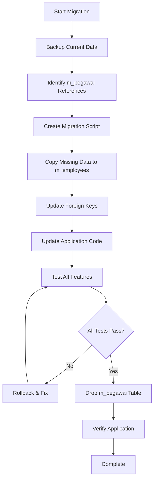
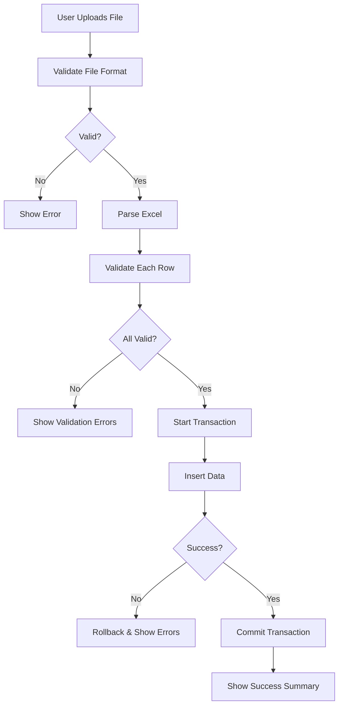

# Design Document: Comprehensive System Refactoring

## Overview

Dokumen ini menjelaskan desain teknis untuk refactoring komprehensif sistem JASPEL. Refactoring ini akan mengatasi masalah performa, duplikasi database, menambahkan fitur yang hilang, dan mempersiapkan aplikasi untuk deployment production di Vercel dengan performa optimal.

## Architecture

### High-Level Architecture

```
┌─────────────────────────────────────────────────────────────┐
│                     Browser (Client)                         │
│  ┌────────────┐  ┌────────────┐  ┌────────────┐            │
│  │   Pages    │  │ Components │  │   Hooks    │            │
│  └────────────┘  └────────────┘  └────────────┘            │
└─────────────────────────────────────────────────────────────┘
                          │
                          ▼
┌─────────────────────────────────────────────────────────────┐
│              Next.js App Router (Server)                     │
│  ┌────────────┐  ┌────────────┐  ┌────────────┐            │
│  │   Routes   │  │  Actions   │  │ Middleware │            │
│  └────────────┘  └────────────┘  └────────────┘            │
└─────────────────────────────────────────────────────────────┘
                          │
                          ▼
┌─────────────────────────────────────────────────────────────┐
│                    Services Layer                            │
│  ┌────────────┐  ┌────────────┐  ┌────────────┐            │
│  │   Auth     │  │   CRUD     │  │  Export    │            │
│  └────────────┘  └────────────┘  └────────────┘            │
└─────────────────────────────────────────────────────────────┘
                          │
                          ▼
┌─────────────────────────────────────────────────────────────┐
│              Supabase (Database + Auth)                      │
│  ┌────────────┐  ┌────────────┐  ┌────────────┐            │
│  │ PostgreSQL │  │    Auth    │  │    RLS     │            │
│  └────────────┘  └────────────┘  └────────────┘            │
└─────────────────────────────────────────────────────────────┘
```

### Database Schema Changes

#### Before (Current State)
```
m_employees (main table)
m_pegawai (duplicate table) ❌
```

#### After (Target State)
```
m_employees (single source of truth) ✅
```

### Migration Strategy



## Components and Interfaces

### 1. Chunk Loading Error Fix

#### Problem Analysis
Error terjadi karena:
- Webpack code splitting yang tidak optimal
- Dynamic imports tanpa proper error handling
- Cache issues di browser

#### Solution Design

**next.config.js Optimization**
```javascript
module.exports = {
  webpack: (config, { isServer }) => {
    if (!isServer) {
      config.optimization = {
        ...config.optimization,
        splitChunks: {
          chunks: 'all',
          cacheGroups: {
            default: false,
            vendors: false,
            commons: {
              name: 'commons',
              chunks: 'all',
              minChunks: 2,
            },
          },
        },
      }
    }
    return config
  },
  // Disable source maps in production
  productionBrowserSourceMaps: false,
  // Optimize output
  compress: true,
}
```

**Error Boundary Component**
```typescript
// components/ErrorBoundary.tsx
'use client'

export class ChunkLoadErrorBoundary extends React.Component {
  componentDidCatch(error: Error) {
    if (error.name === 'ChunkLoadError') {
      window.location.reload()
    }
  }
}
```

### 2. Database Migration Service

#### Interface
```typescript
interface MigrationService {
  backupTable(tableName: string): Promise<BackupResult>
  copyData(source: string, target: string): Promise<CopyResult>
  updateForeignKeys(oldTable: string, newTable: string): Promise<UpdateResult>
  dropTable(tableName: string): Promise<DropResult>
  verifyMigration(): Promise<VerificationResult>
}
```

#### Migration Steps
1. **Backup Phase**
   - Export m_pegawai data to JSON
   - Store backup in safe location

2. **Data Copy Phase**
   - Compare schemas between m_pegawai and m_employees
   - Copy unique records from m_pegawai to m_employees
   - Handle conflicts (duplicate employee_code)

3. **Reference Update Phase**
   - Find all foreign keys pointing to m_pegawai
   - Update to point to m_employees
   - Update RLS policies

4. **Code Update Phase**
   - Replace all `from('m_pegawai')` with `from('m_employees')`
   - Update TypeScript types
   - Update service layer

5. **Verification Phase**
   - Run automated tests
   - Verify all CRUD operations
   - Verify RLS policies

6. **Cleanup Phase**
   - Drop m_pegawai table
   - Remove unused indexes
   - Update documentation

### 3. Template Download Feature

#### Interface
```typescript
interface TemplateService {
  generateUnitTemplate(): Promise<ExcelBuffer>
  generateEmployeeTemplate(): Promise<ExcelBuffer>
  generateUserTemplate(): Promise<ExcelBuffer>
}
```

#### Template Structure

**Unit Template**
```typescript
const unitTemplate = {
  headers: ['code', 'name', 'proportion_percentage'],
  example: ['IT', 'Information Technology', '25.00'],
  validations: {
    code: { type: 'text', maxLength: 20 },
    name: { type: 'text', maxLength: 255 },
    proportion_percentage: { type: 'decimal', min: 0, max: 100 }
  }
}
```

**Employee Template**
```typescript
const employeeTemplate = {
  headers: ['employee_code', 'full_name', 'unit_code', 'role', 'email', 'tax_status'],
  example: ['EMP001', 'John Doe', 'IT', 'employee', 'john@example.com', 'TK/0'],
  validations: {
    employee_code: { type: 'text', maxLength: 50 },
    full_name: { type: 'text', maxLength: 255 },
    unit_code: { type: 'text', reference: 'm_units.code' },
    role: { type: 'enum', values: ['superadmin', 'unit_manager', 'employee'] },
    email: { type: 'email' },
    tax_status: { type: 'enum', values: ['TK/0', 'TK/1', 'K/0', 'K/1', 'K/2'] }
  }
}
```

#### Implementation
```typescript
// lib/export/template-generator.ts
import * as XLSX from 'xlsx'

export class TemplateGenerator {
  generateUnitTemplate(): Buffer {
    const ws = XLSX.utils.aoa_to_sheet([
      ['code', 'name', 'proportion_percentage'],
      ['IT', 'Information Technology', '25.00'],
      ['', '', ''] // Empty row for user input
    ])
    
    // Add data validation
    ws['!dataValidation'] = {
      'C2:C1000': {
        type: 'decimal',
        operator: 'between',
        formula1: '0',
        formula2: '100'
      }
    }
    
    const wb = XLSX.utils.book_new()
    XLSX.utils.book_append_sheet(wb, ws, 'Units')
    return XLSX.write(wb, { type: 'buffer', bookType: 'xlsx' })
  }
}
```

### 4. Data Import Feature

#### Interface
```typescript
interface ImportService {
  validateFile(file: File): Promise<ValidationResult>
  parseExcel(file: File): Promise<ParsedData>
  importUnits(data: UnitData[]): Promise<ImportResult>
  importEmployees(data: EmployeeData[]): Promise<ImportResult>
  importUsers(data: UserData[]): Promise<ImportResult>
}

interface ImportResult {
  success: number
  failed: number
  errors: ImportError[]
}

interface ImportError {
  row: number
  field: string
  message: string
  value: any
}
```

#### Validation Rules
```typescript
const validationRules = {
  unit: {
    code: [required(), maxLength(20), unique('m_units', 'code')],
    name: [required(), maxLength(255)],
    proportion_percentage: [required(), decimal(), between(0, 100)]
  },
  employee: {
    employee_code: [required(), maxLength(50), unique('m_employees', 'employee_code')],
    full_name: [required(), maxLength(255)],
    unit_code: [required(), exists('m_units', 'code')],
    role: [required(), enum(['superadmin', 'unit_manager', 'employee'])],
    email: [required(), email(), unique('m_employees', 'email')],
    tax_status: [required(), enum(['TK/0', 'TK/1', 'K/0', 'K/1', 'K/2'])]
  }
}
```

#### Import Flow


### 5. Export Feature

#### Interface
```typescript
interface ExportService {
  exportToExcel(data: any[], filename: string): Promise<Buffer>
  exportToPDF(data: any[], filename: string, options: PDFOptions): Promise<Buffer>
}

interface PDFOptions {
  title: string
  headers: string[]
  orientation: 'portrait' | 'landscape'
  pageSize: 'A4' | 'Letter'
}
```

#### Excel Export
```typescript
// lib/export/excel-export.ts
export class ExcelExporter {
  export(data: any[], columns: Column[]): Buffer {
    const headers = columns.map(c => c.header)
    const rows = data.map(row => 
      columns.map(c => this.formatValue(row[c.field], c.type))
    )
    
    const ws = XLSX.utils.aoa_to_sheet([headers, ...rows])
    
    // Apply styling
    ws['!cols'] = columns.map(c => ({ wch: c.width || 15 }))
    
    const wb = XLSX.utils.book_new()
    XLSX.utils.book_append_sheet(wb, ws, 'Data')
    
    return XLSX.write(wb, { type: 'buffer', bookType: 'xlsx' })
  }
}
```

#### PDF Export
```typescript
// lib/export/pdf-export.ts
import jsPDF from 'jspdf'
import autoTable from 'jspdf-autotable'

export class PDFExporter {
  export(data: any[], options: PDFOptions): Buffer {
    const doc = new jsPDF({
      orientation: options.orientation,
      unit: 'mm',
      format: options.pageSize
    })
    
    // Add title
    doc.setFontSize(16)
    doc.text(options.title, 14, 15)
    
    // Add metadata
    doc.setFontSize(10)
    doc.text(`Generated: ${new Date().toLocaleString()}`, 14, 22)
    
    // Add table
    autoTable(doc, {
      head: [options.headers],
      body: data,
      startY: 30,
      theme: 'grid',
      styles: { fontSize: 8 }
    })
    
    return Buffer.from(doc.output('arraybuffer'))
  }
}
```

### 6. Performance Optimization

#### Caching Strategy
```typescript
// lib/hooks/useDataCache.ts
export function useDataCache<T>(
  key: string,
  fetcher: () => Promise<T>,
  options: CacheOptions = {}
) {
  const { revalidateOnFocus = false, dedupingInterval = 2000 } = options
  
  return useSWR(key, fetcher, {
    revalidateOnFocus,
    dedupingInterval,
    onError: (error) => {
      console.error(`Cache error for ${key}:`, error)
    }
  })
}
```

#### Optimistic Updates
```typescript
// Example: Optimistic update for unit creation
async function createUnit(data: UnitInput) {
  // Optimistically update UI
  mutate('/api/units', (current) => [...current, { ...data, id: 'temp' }], false)
  
  try {
    const result = await unitService.create(data)
    // Revalidate with real data
    mutate('/api/units')
    return result
  } catch (error) {
    // Rollback on error
    mutate('/api/units')
    throw error
  }
}
```

#### Pagination
```typescript
interface PaginationOptions {
  page: number
  pageSize: number
  sortBy?: string
  sortOrder?: 'asc' | 'desc'
}

async function fetchPaginated<T>(
  table: string,
  options: PaginationOptions
): Promise<PaginatedResult<T>> {
  const { page, pageSize, sortBy, sortOrder } = options
  const from = (page - 1) * pageSize
  const to = from + pageSize - 1
  
  let query = supabase
    .from(table)
    .select('*', { count: 'exact' })
    .range(from, to)
  
  if (sortBy) {
    query = query.order(sortBy, { ascending: sortOrder === 'asc' })
  }
  
  const { data, count, error } = await query
  
  return {
    data: data || [],
    total: count || 0,
    page,
    pageSize,
    totalPages: Math.ceil((count || 0) / pageSize)
  }
}
```

### 7. Sidebar Fix

#### Problem Analysis
Sidebar hilang karena:
- Layout structure yang tidak tepat
- State management yang tidak persistent
- Re-render yang tidak perlu

#### Solution Design

**Layout Structure**
```typescript
// app/layout.tsx
export default function RootLayout({ children }: { children: React.Node }) {
  return (
    <html>
      <body>
        <AuthProvider>
          {children}
        </AuthProvider>
      </body>
    </html>
  )
}

// app/(authenticated)/layout.tsx
export default function AuthenticatedLayout({ children }: { children: React.Node }) {
  return (
    <div className="flex h-screen">
      <Sidebar /> {/* Always rendered */}
      <main className="flex-1 overflow-auto">
        {children}
      </main>
    </div>
  )
}
```

**Persistent Sidebar Component**
```typescript
// components/navigation/Sidebar.tsx
'use client'

export function Sidebar() {
  const pathname = usePathname()
  const { user, role } = useAuth()
  
  // Memoize menu items to prevent re-render
  const menuItems = useMemo(() => getMenuItemsByRole(role), [role])
  
  return (
    <aside className="w-64 bg-gray-900 text-white">
      <nav>
        {menuItems.map(item => (
          <SidebarItem
            key={item.path}
            item={item}
            isActive={pathname === item.path}
          />
        ))}
      </nav>
    </aside>
  )
}
```

### 8. Navigation Optimization

#### Remove Unnecessary Rebuilding

**Problem**: Console shows "rebuilding" on every navigation
**Cause**: Development mode HMR + improper use of router.refresh()

**Solution**:
```typescript
// Remove unnecessary router.refresh() calls
// Before:
function handleSuccess() {
  router.refresh() // ❌ Causes full page rebuild
  router.push('/dashboard')
}

// After:
function handleSuccess() {
  revalidatePath('/dashboard') // ✅ Only revalidates specific path
  router.push('/dashboard')
}
```

**Optimize Server Actions**:
```typescript
// app/admin/units/actions.ts
'use server'

export async function createUnit(data: UnitInput) {
  const supabase = createServerClient()
  
  const { error } = await supabase
    .from('m_units')
    .insert(data)
  
  if (error) throw error
  
  // Only revalidate the specific path
  revalidatePath('/admin/units')
  
  return { success: true }
}
```

### 9. Vercel Optimization

#### Build Configuration
```javascript
// next.config.js
module.exports = {
  // Optimize for Vercel
  output: 'standalone',
  
  // Reduce bundle size
  compiler: {
    removeConsole: process.env.NODE_ENV === 'production',
  },
  
  // Optimize images
  images: {
    formats: ['image/avif', 'image/webp'],
    deviceSizes: [640, 750, 828, 1080, 1200],
  },
  
  // Optimize fonts
  optimizeFonts: true,
  
  // Server actions configuration
  experimental: {
    serverActions: {
      bodySizeLimit: '5mb',
    },
  },
}
```

#### Environment Variables
```bash
# .env.production
NEXT_PUBLIC_SUPABASE_URL=your_production_url
NEXT_PUBLIC_SUPABASE_ANON_KEY=your_production_key
SUPABASE_SERVICE_ROLE_KEY=your_service_role_key

# Vercel-specific
VERCEL_URL=auto
NEXT_PUBLIC_SITE_URL=https://your-domain.vercel.app
```

## Data Models

### Unified Employee Model
```typescript
interface Employee {
  id: string
  employee_code: string
  full_name: string
  unit_id: string
  role: 'superadmin' | 'unit_manager' | 'employee'
  email: string
  tax_status: TaxStatus
  is_active: boolean
  created_at: string
  updated_at: string
  
  // Relations
  unit?: Unit
}
```

### Import/Export Models
```typescript
interface ImportData {
  file: File
  type: 'unit' | 'employee' | 'user'
}

interface ExportOptions {
  format: 'excel' | 'pdf'
  filters?: Record<string, any>
  columns?: string[]
}

interface TemplateConfig {
  headers: string[]
  example: any[]
  validations: Record<string, ValidationRule[]>
}
```

## Error Handling

### Chunk Loading Error
```typescript
// app/error.tsx
'use client'

export default function Error({
  error,
  reset,
}: {
  error: Error & { digest?: string }
  reset: () => void
}) {
  useEffect(() => {
    // Log to error reporting service
    console.error('Application error:', error)
    
    // Auto-reload on chunk load error
    if (error.message.includes('Loading chunk')) {
      window.location.reload()
    }
  }, [error])
  
  return (
    <div className="error-container">
      <h2>Something went wrong!</h2>
      <button onClick={reset}>Try again</button>
    </div>
  )
}
```

### Import Error Handling
```typescript
async function handleImport(file: File) {
  try {
    const result = await importService.import(file)
    
    if (result.failed > 0) {
      showErrorDialog({
        title: 'Import Partially Failed',
        message: `${result.success} records imported, ${result.failed} failed`,
        errors: result.errors
      })
    } else {
      showSuccess(`Successfully imported ${result.success} records`)
    }
  } catch (error) {
    showError('Import failed: ' + error.message)
  }
}
```

## Testing Strategy

### Unit Tests
- Test template generation functions
- Test import validation logic
- Test export formatting
- Test migration scripts

### Integration Tests
- Test complete import flow (upload → validate → insert)
- Test complete export flow (fetch → format → download)
- Test migration flow (backup → copy → update → verify)
- Test navigation without sidebar disappearing

### E2E Tests
- Test login → navigate → perform action → logout
- Test import feature end-to-end
- Test export feature end-to-end
- Test all CRUD operations for each management page

### Performance Tests
- Measure page load times
- Measure navigation speed
- Measure import/export speed for large datasets
- Measure database query performance

## Deployment Checklist

### Pre-Deployment
- [ ] Run all tests
- [ ] Run database migration
- [ ] Verify no m_pegawai references
- [ ] Build succeeds without errors
- [ ] Bundle size within limits
- [ ] Environment variables configured

### Deployment
- [ ] Deploy to Vercel
- [ ] Run smoke tests
- [ ] Verify all pages load
- [ ] Verify authentication works
- [ ] Verify import/export works

### Post-Deployment
- [ ] Monitor error logs
- [ ] Monitor performance metrics
- [ ] Verify RLS policies
- [ ] Test with real users

## Implementation Phases

### Phase 1: Critical Fixes (Week 1)
1. Fix chunk loading error
2. Fix sidebar disappearing
3. Fix authentication errors
4. Eliminate unnecessary rebuilding

### Phase 2: Database Migration (Week 1-2)
1. Create migration script
2. Test migration in development
3. Execute migration
4. Update all code references
5. Verify all features work

### Phase 3: New Features (Week 2-3)
1. Implement template download
2. Implement data import
3. Implement data export
4. Add comprehensive error handling

### Phase 4: Optimization (Week 3-4)
1. Optimize for Vercel
2. Improve responsiveness
3. Add caching
4. Add pagination

### Phase 5: Testing & Deployment (Week 4)
1. Comprehensive testing
2. Performance testing
3. Deploy to production
4. Monitor and fix issues


## Correctness Properties

A property is a characteristic or behavior that should hold true across all valid executions of a system—essentially, a formal statement about what the system should do. Properties serve as the bridge between human-readable specifications and machine-verifiable correctness guarantees.

### Property 1: Error Boundary Catches Dynamic Import Failures
*For any* dynamic import that fails to load, the error boundary should catch the error and provide a recovery mechanism (reload or retry)
**Validates: Requirements 1.4, 1.5**

### Property 2: Database Migration Preserves Data Integrity
*For any* employee record in m_employees after migration, there should exist a corresponding record with the same employee_code that existed before migration
**Validates: Requirements 2.7**

### Property 3: Import Validation Rejects Invalid Data
*For any* row in an imported Excel file that violates validation rules (missing required fields, invalid foreign keys, duplicate unique constraints), the import process should reject that row and report a specific error
**Validates: Requirements 4.5, 4.6, 4.9**

### Property 4: Import Success Preserves Data Consistency
*For any* successfully imported row, the data in the database should exactly match the data in the Excel file (after type conversion)
**Validates: Requirements 4.6, 4.7**

### Property 5: Export Completeness
*For any* data export operation, the exported file should contain all rows that match the current filter criteria, with no data loss
**Validates: Requirements 5.7**

### Property 6: Export Format Correctness
*For any* exported file, the headers and data types should match the expected format specification for that export type (Excel or PDF)
**Validates: Requirements 5.8**

### Property 7: CRUD Operations Maintain Database Constraints
*For any* create, update, or delete operation on m_employees, all database constraints (unique, foreign key, not null) should be enforced
**Validates: Requirements 6.9**

### Property 8: Navigation Preserves Sidebar State
*For any* navigation between pages in the authenticated section, the sidebar should remain visible and maintain its active menu state
**Validates: Requirements 10.1, 10.2, 10.3**

### Property 9: Authentication Flow Consistency
*For any* valid user credentials, the login process should succeed and grant access to the appropriate dashboard based on role
**Validates: Requirements 11.1**

### Property 10: Response Time Performance
*For any* user action (button click, form submit), the system should provide visual feedback within 100ms
**Validates: Requirements 9.1**

### Property 11: Loading State Visibility
*For any* asynchronous operation (data fetch, form submit), a loading indicator should be visible until the operation completes
**Validates: Requirements 9.2**

### Property 12: Template Structure Validity
*For any* generated template file, the structure should match the expected schema with correct headers, example data, and validation rules
**Validates: Requirements 3.4, 3.5, 3.6, 3.7**

### Property 13: Import Transaction Atomicity
*For any* import operation, either all valid rows should be inserted successfully, or none should be inserted (transaction rollback on error)
**Validates: Requirements 4.6**

### Property 14: Export Metadata Completeness
*For any* exported file, the metadata (timestamp, user, filters applied) should be included and accurate
**Validates: Requirements 5.9**

### Property 15: Migration Rollback Safety
*For any* migration that fails validation, the system should be able to rollback to the previous state without data loss
**Validates: Requirements 2.3**
